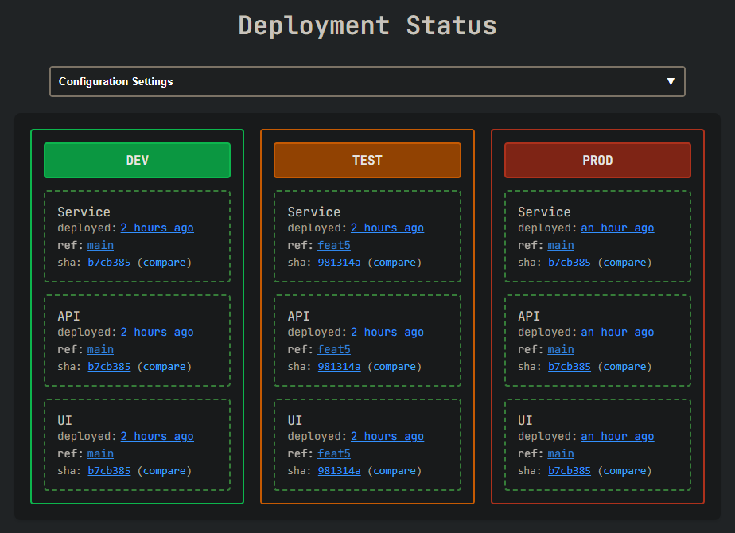

# GitHub Environments Demo

This repo includes notes and an example workflow that uses [GitHub environments](https://docs.github.com/en/actions/managing-workflow-runs-and-deployments/managing-deployments/managing-environments-for-deployment) as well as an [custom dashboard](#deployment-dashboard) for displaying deployment status.

## Benefits of Environments

- **Visibility** - After an environment deployment has occurred a link to the [deployment history page](https://github.com/sethreno/env-deploy-example/deployments) will be displayed on the repo home page and the data will be available via the [GitHub API](https://docs.github.com/en/rest/deployments/deployments?apiVersion=2022-11-28)

- **Protection Rules** - Require manual review, restrict prod deployments to release branch, etc...

## Lessons Learned

- Limit use of the `environment` attribute to jobs that a deploy.

  This might seem obvious, but in the past I've used the `environment`
  attribute to read environment specific configuration for "setup" or "smoke
  test" jobs that run in the same workflow before and after the actual
  deployment job.

  This caused noise and confusion in the deployment history. For example a workflow run where the `setup` job succeeded but the `deploy` job failed still appears as a successful deployment.

- Deploy the ref selected in the built-in ref picker.

  Okay, maybe another obvious one... I've made the mistake of building more complex workflows that used the ref picker to select the version of the workflow to run but allowing an additional input to select the version or tag to actually deploy.

  Again this caused confusion on the deployment history and made it very
  difficult to tell what version of the code was actually deployed.

## Deployment Dashboard

A static site that demonstrates the use of [GitHub's
API](https://docs.github.com/en/rest/deployments/deployments?apiVersion=2022-11-28)
for building custom dashboards.

It provides improved visibility for projects with components in multiple repositories and can be configured to show deployment status for any repo. Configuration is stored in you're browser's [localStorage](https://developer.mozilla.org/en-US/docs/Web/API/Window/localStorage).

View it online: [here](https://sethreno.github.io/env-deploy-example/).

# 
